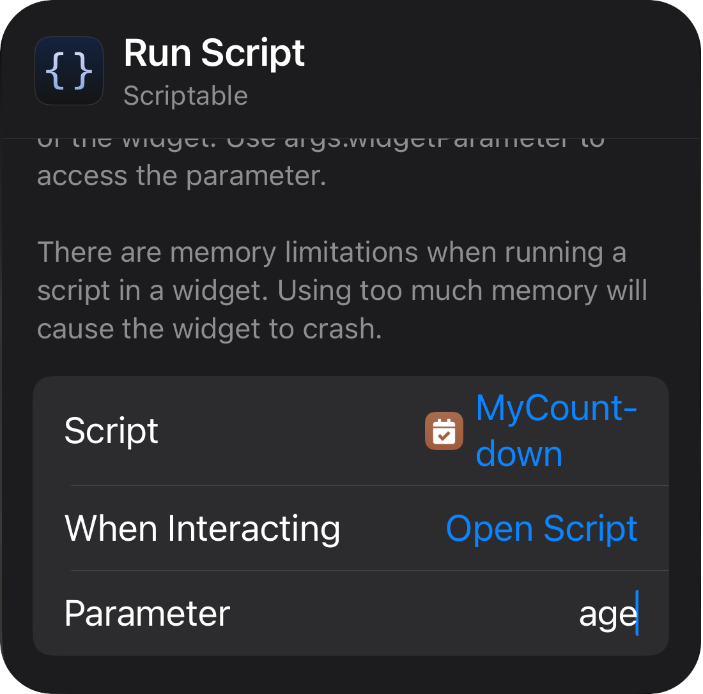

# 🎉 Countdown Widget 

A fully-featured countdown widget built using the [Scriptable app](https://scriptable.app) and powered by data from Google Sheets. It helps you track important upcoming events like birthdays, anniversaries, and more—right on your iOS home screen.


## ✨ Features

- 📅 **Dynamic Countdown**: Displays the number of days until your events.
- 🎂 **Age Tracking**: Shows the age or years together for birthdays and anniversaries.
- 📝 **Customizable Events**: Load your events directly from a Google Sheets database.
- 🎨 **Vibrant Themes**: Automatically assigns color themes to events.
- ⚙️ **Widget Modes**: Supports multiple widget sizes and display styles.


## 🚀 How It Works

This widget pulls your event data from a **Google Sheets web app** endpoint and sorts events based on the closest upcoming date.  
Depending on the widget size and parameters, it displays:

✅ **Single-event view** (small widget)  
✅ **Grid view** (for `col` parameter)  
✅ **List view** (default for medium/large widgets)  


## 🔧 Setup and Usage

### 1️. Create Your Google Sheets Database

- Create a Google Sheet with columns like:  
  | name | date       | icon | color  |  
  |------|------------|------|--------|  
  | Mom | 2003-09-25 | 🎂   | #2980b9 |  
  | Dad   | 1975-07-01 | 🎂   | #F79F39 |  

- Format the **date** column as YYYY-MM-DD for best results.

### 2️. Publish Your Google Sheet as a Web App

1. In Google Sheets, click **Extensions > Apps Script**.  
2. In the script editor, paste this example code:

    ```javascript
    function doGet() {
      const sheet = SpreadsheetApp.getActiveSpreadsheet().getActiveSheet();
      const data = sheet.getDataRange().getValues();
      const events = [];
      for (let i = 1; i < data.length; i++) {
        const row = data[i];
        const name = row[0];
        const date = row[1];
        const icon = row[2] || "📅";
        const color = row[3] || "";
        // Skip empty rows
        if (!name || !date) continue;
        // Always format the date string as "YYYY-MM-DD"
        let formattedDate;
        if (date instanceof Date) {
          formattedDate = Utilities.formatDate(date, Session.getScriptTimeZone(), "yyyy-MM-dd");
        } else {
          formattedDate = date; // fallback to what's in the cell
        }
        // Build event object
        const event = {
          name: name,
          date: formattedDate,
          icon: icon
        };
        // Only add color if present
        if (color) {
          event.color = color;
        }
        events.push(event);
      }
      return ContentService
        .createTextOutput(JSON.stringify(events))
        .setMimeType(ContentService.MimeType.JSON);
    }
    ```

3. Click the **Deploy** button (top-right corner), then **New deployment**.  
4. Under **Select type**, choose **Web app**.  
5. Set who has access to **Anyone**.  
6. Click **Deploy** and **Authorize access**.  
7. Copy the **Web App URL** (e.g., `https://script.google.com/macros/s/AKfycb.../exec`).


### 3️. Insert Your API URL into the Script

In the **`countdown.js`** script file, find the line:

```javascript
const SHEET_API_URL = "https://script.google.com/macros/s/AKfycb.../exec";
````

Replace the URL with **your own** Web App URL you just created.

✅ Save the script.


### 4️ Using in Scriptable

* Copy the updated `countdown.js` script to a new script in the Scriptable app.
* On your home screen, add a Scriptable widget and select this script.
* Customize widget parameters as needed (see below).


## 🛠️ Widget Usage

Here’s how to configure the widget for different modes:

1. **Single Event View (Small Widget)**
   * **Applies to:** Small widgets by default.  
   * **Displays:** The next upcoming event with days left, age (if a birthday/anniversary is today), and date.
  
2. **Default List View**
    - **Applies to:** Medium and Large widgets by default.  
    - **Displays:** A scrollable list of the top upcoming events with countdowns.


3. **Parameters Configuration**

<p align="center">

<table>
  <tr>
    <th>Option</th>
    <th>Defaults</th>
    <th>Change to</th>
  </tr>
  <tr>
    <td>Script</td>
    <td>Choose</td>
    <td>Widget Name (e.g., Countdown Widget)</td>
  </tr>
  <tr>
    <td>While Interacting (optional)</td>
    <td>Open App</td>
    <td>Run Script</td>
  </tr>
  <tr>
    <td>Parameters</td>
    <td>Text</td>
    <td>For example:<br/>
      <ul>
        <li> <code>age</code> to show age in small widget. </li>
        <li> <code>2</code> to select second event. </li>
        <li> <code>john,age</code> to select by name and show age (order doesn’t matter). </li>
        <li> <code>col</code> to enable grid view (best for large widgets). </li>
      </ul>
    </td>
  </tr>
</table>
</p>

<!-- [!NOTE] --> 
> _Here's a Screenshot of widget's config panal_
 

<!--  --> 




### **Examples**
* **Show Age Mode:**
```
age
```
* **Select by index:**
```
2
```
* **Select by name and show age:**
```
john,age
```
* **Enable Grid View:**
```
col
```
<br/>

> [!Important]
🔒 **Do not share your personal Web App URL publicly** to protect your Google Sheet data.\
💡 **You can always update the Google Sheet without modifying the widget script again!**


## 📷 Screenshots

*(Add screenshots here of your widget in action!)*


## 🙌 Feedback
If you have any features requests or feedback on this widget, feel free to DM me on [instagram](https://www.instagram.com/the.tirth12?igsh=MTlvNGh5cm00YjJteg%3D%3D&utm_source=qr) or email me at <rushiofficial1205@email.com>.\
Widgets that help us passively learn should not be limited to facts alone—they can extend into all kinds of domains. If you have any such idea in mind, let me know!

## 📜 License

This project is licensed under the **MIT License**.
Feel free to use, modify, and share—just give proper credit!

Enjoy using this widget and feel free to share feedback or improvements! 🚀✨